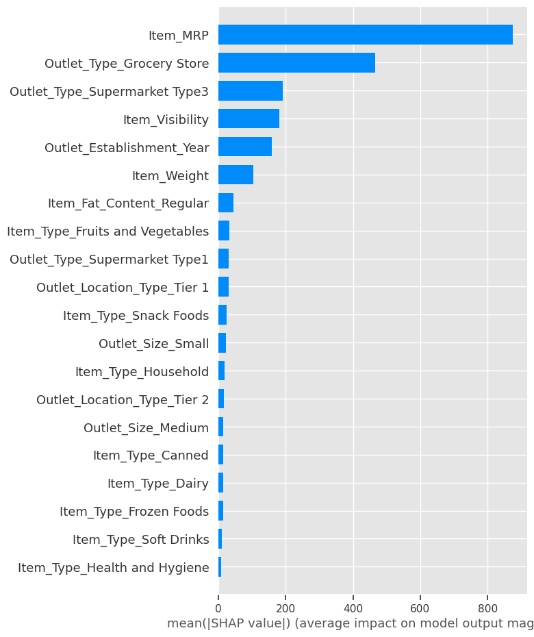
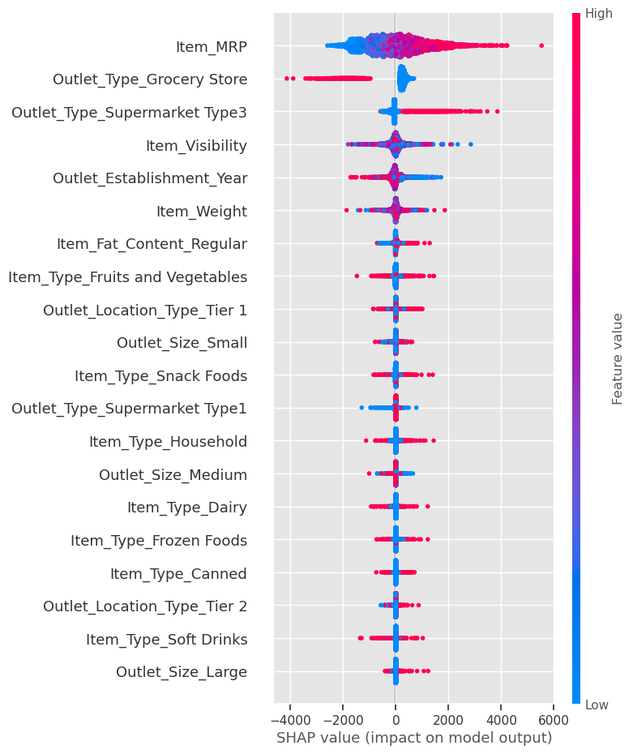

# Grocery Store Sales Predictions

## Analyzing Various Factors to Predict Future Sales of Grocery Stores

Kevin Barnett

**Business Problem**:

Help the retailer understand the properties of products and outlets that play crucial roles in increasing sales.
 
## Data Source:

 Original Dataset: https://datahack.analyticsvidhya.com/contest/practice-problem-big-mart-sales-iii/
 
 In this dataset there are 12 columns and 8523 rows.
 
 ## Data Dictionary:
 
 

## To Prepare the dataset, it was cleaned, and the following processes were performed:

## Exploratory Data Analysis:

**Item Sales Count Histogram**

> We can see that the data for item sales and visibility are both skewed to the right. Both of these features also have a significant amount of outliers.

## Explanatory Data Analysis:

>We can see that medium size outlets account for a majority of sales

## Models Evaluated and Results:

- Linear Regression Model (Testing Set)
  - Model testing MAE: 803.98
  - Model testing MSE: 1194496.09
  - Model testing RMSE: 1092.93
  - Model testing R2: 0.57
 
- Decision Tree Model (Testing set)
  - Model testing MAE: 1044.70
  - Model testing MSE: 2260854.78
  - Model testing RMSE: 1092.93
  - Model testing R2: 0.18

## Top 3 Coefficients Interpretation

> The most important features the model used for predictions were the 3 Outlet_Type_Supermarket. If a store is Outlet_Type_Supermarket Type 3 sales will increase by \\$3,814.83.If a store is Outlet_Type_Supermarket Type 1 sales will increase by \\$1,511.40. If a store is Outlet_Type_Supermarket Type 2 sales will increase by \\$1,278.18

## Most Important Features from Decision Tree Model

 
## Global Explanations
## SHAP Summary Bar Plot

> Both the SHAP explainer summary plot and the feature importances plot contained the same top 5 features. The only difference is that in the SHAP summary Item_visibility was the 4th most important feature and in the feature importances Item_visibility was the 3rd most important feature.

## SHAP Summary Dot Plot

> - Item_MRP:
     - Lower Item_MRP values produce less sales and higher Item_MRP values produce more sales.
> - Outlet_Type_Grocery Store:
     - Outlet types that are grocery stores have a negative impact on sales. Sales are higher if the outlet type is not a grocery store.
> - Outlet_Type_Supermarket Type3:
     - Sales are generally higher for outlet types of supermarket 3. However, if the outlet type is not supermarket 3 there is little to no negative effect on sales.

## Local Explanations

> I chose to use the store with the highest and lowest Item_MRP to compare the store with higher and lower sales. This will allow me to see what features pushed predictions positively for a store with higher and lower sales

## Highest Item_MRP
## Decision Tree Model

> The predicted store sales was 5034.78. Outlet_Type_Grocery_Store and Item_MRP both had a positive influences on store sales prices

> Having an Item_MRP=1.995 significantly pushed the prediction towards lower store sales. Item_Visibility=1.438 was the largest feature pushing the model toward higher store sales

## Linear Regression Model

> The predicted value for store sales was 4310.39. Outlet_Type_Supermarket3 had the most influence on the models decisions and has negative influence. Item_MRP and Outlet_Type_Grocery Store were the next two most influential features and influenced the model positively

> Having an Item_MRP=1.995 significantly pushed the prediction towards lower store sales. A store not being an Outlet_Type_Supermarket Type3 pushed the prediction towards higher store sales

## Lowest Item_MRP
## Decision Tree Model

> The predicted value for store sales was 898.83. Outlet_Type_Grocery Store influenced the model the most positively and Item_MRP influenced the model the most negatively

> A store being an Outlet_Type_Supermarket Type3 significantly pushed the prediction towards lower sales. Item_MRP=-1.768 significantly pushed the prediction toward higher store sales

## Linear Regression Model

> The predicted value for store sales was 1934.48. Outlet_Type_Supermarket Type3 and Outlet_Type_Grocery Store had the most positive influence. Item_MRP had the most negative influence

> A store being an Outlet_Type_Supermarket Type3 and an Outlet_Establishment_Year=-1.532 pushed the prediction towards lower sales. Item_MRP=-1.768 significantly pushed the prediction toward higher store sales

## Final Recommendations:

The model I recommend using is the linear regression model. The testing model performed better than the decision tree and the training and testing set of the linear regression model performed similarly suggesting that there is low bias.
